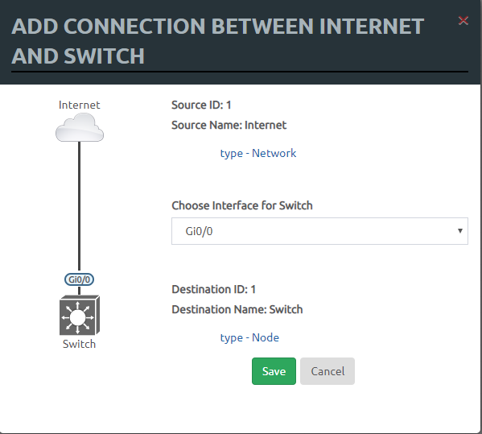

## Chuẩn bị

Đầu tiên, chúng ta cần một hệ thống LAB EVE và các image giả lập.

Ở đây, tôi đã có sẵn nhiều thứ:

- ESXi: Hypervisor để quản lý các VM
- PFsence: Tạo VPN kết nối vào hệ thống LAB
- EVE-NG: Máy ảo trong ESXi, sử dụng làm LAB
- AD: Máy ảo trong ESXi, sử dụng làm LAB
- ISE: Máy ảo trong ESXi, sử dụng làm LAB

## Khởi tạo VPN

Phần khai báo cấu hình, cài đặt PFsence chúng ta sẽ đề cập sau, bây giờ tận hưởng thành quả là khởi tạo user để kết nối vào hệ thống LAB

Trên PFsence khởi tạo ca, key, user rồi tải bản client cho windows.

Trên windows thì cài đặt client, sẽ cài kèm OpenVPN nếu máy windows chưa có, các thông tin cấu hình sẽ được giải nén ra thư mục config

Kết nối VPN và vào LAB

## Kết nối EVE-NG

Mặc định cũng có sẵn EVE rồi, chúng ta truy cập vào địa chỉ website của EVE bằng user đã được khởi tạo sẵn trên EVE để tạo LAB

Đường dẫn truy cập vào EVE là: [http://172.16.10.42](http://172.16.10.42)

Đăng nhập bằng user được khai báo trên EVE. Tôi sừ dụng user `itforvn9`, passwd là `it4vn.COM`


Sau khi login vào, là 1 trang giấy trắng, chưa có thiết bị gì cả. Như hình dưới


## Tạo mô hình LAB

Ta thực hiện tạo mô hình LAB.

Đầu tiên, chuột phải vào bảng trắng --> chọn Node


Ở bảng `ADD A NEW NODE` --> chọn vào Template --> Cisco vIOS L2. Ở bảng thông số, có thể đổi tên, thiết lập tham số resource cho thiết bị (RAM, CPU), số lượng interface.


Tiếp tục thêm vào một con PC bằng cách tương tự. nhưng thay vì chọn switch, ta chọn Windows


Để SW kết nối ra được mạng bên ngoài, ta sử dụng một network tên là `Cloud0`, đây là một card được NAT ra bên ngoài internet cho các thiết bị nằm trong EVE. Ta chuột phải --> Network --> Cloud0


Từ Network `Cloud0` ta đưa chuột vào và kéo một kết nối từ biểu tượng ổ cắm tới con `Switch` --> để interface trên Switch là Gi0/0 --> chọn save



Từ con `Win` ta cũng kéo một kết nối tới con `Switch` luôn.


Sau khi tạo xong được `Switch`, `Win`, `Internet`, ta vẫn còn thiết 02 thiết bị khác là `AD` và `ISE`. 02 con đó ta sử dụng VM ngay trên nền hypervisor là `ESXi`. Trong mô hình này ta chỉ vẽ tượng trưng chứ ko start 02 thiết bị này. Vì việc kết nối với nó đã thông qua Network `Cloud0` rồi.

Tạo tượng trưng nhưng vẫn là thiết bị thật, lưu ý là ko start nó lên. Chuột phải --> Node --> Cisco IOL --> Icon chọn Server.png, Đổi name là AD --> Save


Tương tự như trên nhưng lần này chọn Icon là ISE.png, đổi name là ISE


Kéo đường kết nối từ `AD` tới `Switch`, `ISE` tới `Switch`.

Mô hình đầy đủ như sau:


## Quản trị ISE và AD qua VMware

Truy cập vào địa chỉ `https://103.54.251.4`, đăng nhập vào bằng tài khoản đã được cấp


Tài khoản này chỉ được phân quyền quản trị 02 thiết bị là `ISE` và `AD`

Trước khi lab thì ta nên tạo một bản snapshot để nếu có gặp lỗi hoặc muốn làm lại thì có thể recovery lại.

## Thực hiện khai báo cấu hình Switch

Từ EVE, bật 02 thiết bị `Switch` và `Win`, ko được bật `AD`, và `ISE`.

Để có thể truy cập vào thiết bị EVE bằng putty, ta cài phần mềm UnetLab-Win-client ở (link)[https://drive.google.com/uc?authuser=0&id=0B9BE8F_c8sLITWZrdnFMVmE2Ykk&export=download]

Vào đường dẫn `C:\Program Files\UNetLab` --> chọn vào `win7_64bit_putty.reg`

Sau khi thiết bị Switch khởi động lên, ta mở kết nối tới thiết bị bằng cách nhấp chuột trái vào `Switch`, một cửa sổ hiện ra hỏi mở bằng gì, chọn SSH để mở bằng putty.


Bắt đầu thực hiện cấu hình switch

#### Đặt hostname và mật khẩu login

Chạy các lệnh sau:

```sh
enable
configure terminal
hostname Switch
enable password itforvn.com
line con 0
logging synchronous
```

#### Cấu hình xác thực AAA

Chạy các lệnh sau

```sh
aaa new-model
aaa group server radius ISE
server name ISE
aaa group server tacacs+ ISE_GROUP
server name ISE1
```

Cấu hình AAA với RADIUS bằng đoạn lệnh sau. lưu ý là IP `172.16.10.32` là IP của ISE server

```sh
aaa authentication login default group ISE
aaa authentication dot1x default group ISE
aaa authorization exec default none
aaa authorization network default group ISE
aaa accounting update periodic 5
aaa accounting dot1x default start-stop group radius
aaa accounting system default start-stop group radius
aaa server radius dynamic-author
client 172.16.10.32 server-key itforvn.com
aaa session-id common
dot1x system-auth-control
dot1x critical eapol
radius server ISE
address ipv4 172.16.10.32 auth-port 1812 acct-port 1813
key itforvn.com
```

Cấu hình AAA cho TACACS++

```sh
aaa authentication login AAA group ISE_GROUP local
aaa authentication enable default group ISE_GROUP enable
aaa authorization config-commands
aaa authorization exec AAA group ISE_GROUP local
aaa authorization commands 0 AAA group ISE_GROUP local
aaa authorization commands 1 AAA group ISE_GROUP local
aaa authorization commands 15 AAA group ISE_GROUP local
tacacs server ISE1
address ipv4 172.16.10.32
key itforvn.com
```


